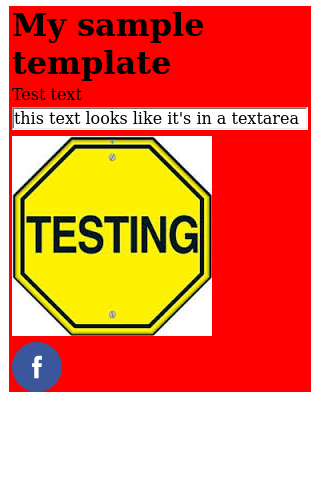

# template-shot
A simple library which can render the html template

## Installation

This module is installed via npm (comming soon):

```
npm install --save template-shot
```

## Examples

This example renders the sample template [index.html](examples/templates/index.html) into [example1.png](examples/example1.png). Notice, that {paragraph_text} is replaced with `Test text` in the rendered image.
```
const {TemplateShot} = require( '../build/index');

const templatePath = __dirname + '/examples/templates';
console.log('looking for templates in:\n' + templatePath);

const ts = new TemplateShot(templatePath);

console.log('rendering template index.html to example1.png');
ts.renderFile('index.html', {'paragraph_text' : 'Test text'}, 'example1.png');
```
### Rendered image


Run this script from the root folder of the project.

See [examples](examples) folder for more examples.

TODO: add template examples

## Contributing

### To set up your development environment:

1. Clone the repo to your desktop,
2. In the shell `cd` to the main folder,
3. Hit `npm install`

### To build the project (including the tests):
    `npm run build`
### To watch the files for changes and rebuild if necessary:
    `npm run wath`
### To run tests:
    `npm run test`
### To run linter:
    `npm run lint`